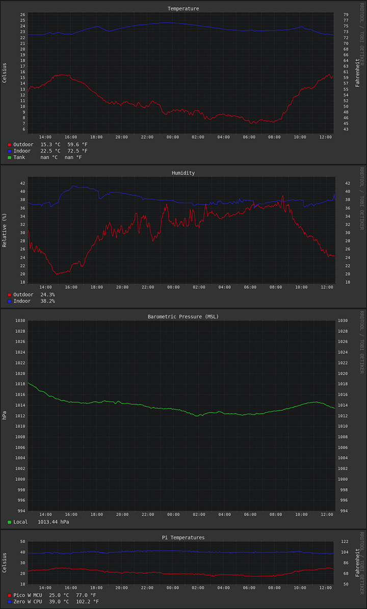

# reefer

tl;dr Yeah, but what does it look like?



This started out as a project to control my reef aquarium, hence the name. It then morphed into a simple Python script to check the indoor temp/humidity and compare it with the outdoors using OpenWeather API. Update: It now monitors the temperature of my aquarium!

Note: This project is now split into a FT232H version and a Raspberry Pi version. Updated 11/11/2021

## FT232H

The hardware is a FT232H from Adafruit and a Si7021 sensor. The FT232H is a pain in the butt to set up from scratch, espcially on Windows. I use Zadig to change the driver to libusbK, then the environment variable must be set "BLINKA_FT232H=1". Use the hack to refresh the environment variables without rebooting (now included, see ```RefreshEnv.cmd```), then the Python script should work. If you ever switch USB ports you must use Zadig to change the driver again.

Adafruit has written a guide for the FT232H, but it is confusing and becoming out of date: https://learn.adafruit.com/circuitpython-on-any-computer-with-ft232h

### Dependencies
- Python 3
- pip3
- pyftdi
- pyserial
- pyusb
- Adafruit-Blinka
- adafruit-circuitpython-busdevice
- adafruit-circuitpython-si7021
- Adafruit-PlatformDetect
- Adafruit-PureIO
- requests
- charset_normalizer
- certifi
- urllib3
- idna
- rrdtool (added to system $PATH/%PATH%/Path)

### RRD
#### Create RRD databases:

```
$ rrdtool create temperatures-c.rrd --step 60 DS:outdoor:GAUGE:120:0:55 DS:indoor:GAUGE:120:0:55 RRA:MAX:0.5:1:1440
$ rrdtool create humidities.rrd --step 60 DS:outdoor:GAUGE:120:0:100 DS:indoor:GAUGE:120:0:100 RRA:MAX:0.5:1:1440
```
This will create databases with a 60 second interval, 120 second heartbeat timeout, between 0 and 55 degrees Celsius, and 0-100% relative humidity, with 24 hours of data before rolling over. You may need to configure for lower than 0 degrees Celsius, but I live in the second hottest place on the planet so these are my settings.

More information here: https://michael.bouvy.net/post/graph-data-rrdtool-sensors-arduino

### HTML

```index.html```

Very simple HTML to display both graphs. This does not need a webserver. It can be opened locally and will refresh the entire page every 60 seconds.

Note: This version is no longer under active development. See Pi version below.

## Raspberry Pi

I moved the project from a FT232H to a Raspberry Pi Zero W and added a DS18B20 waterproof temperature sensor for an aquarium. With plenty of GPIO on the Pi and relays in hand, I plan on controlling pumps/lights/etc in the future.

### Hardware
#### Si7021
https://pinout.xyz/pinout/i2c
- VIN to 3v3 (pin 1)
- GND to ground (pin 9)
- SCL to GPIO 3 [I2C1 SCL Clock] (pin 5)
- SDA to GPIO 2 [I2C1 SDA Data] (pin 3)

#### DS18B20
https://pinout.xyz/pinout/1_wire
- Red Wire to 5v (pin 2)
- Blue Wire to ground (pin 6 or 9)
- Yellow Wire to GPIO 4 [Data] (pin 7)
- 4k7 pullup resistor between 5V and Data (yellow wire)

According to my testing, Google searches, and the DS18B20 datasheet 3v3 is not enough voltage to pull up the data line with the commonly included 4k7 resistor. I measured ~1.6 volts with the 4k7 resistor in place and the datasheet says it wants a minimum of 3.0 volts. I was having massive dropouts of the sensor until I switched everything from the 3v3 rail to the 5v rail. I don't know how anybody else got it working on 3v3 and then wrote the guides floating around the web (I'm looking at you too Adafruit!). You could, of course, substitute an appropriate resistor and still use 3v3 based on some multimeter measuring, calculating, etc. But why not give that sucker some juice! It's been rock solid since I changed to the 5v rail + 4k7 pullup.

### Dependencies

You can satisfy pretty much all dependencies with these commands on a fresh Pi:
```
$ sudo apt install git nginx rrdtool python3-pip
$ sudo pip install adafruit-circuitpython-si7021
$ sudo pip install git+https://github.com/nicmcd/vcgencmd.git
```

I2C and 1-Wire interfaces must be turned on in ```$ sudo raspi-config```

### RRD
#### Create RRD databases:

```
$ rrdtool create temperatures.rrd --step 60 DS:outdoor:GAUGE:120:0:55 DS:indoor:GAUGE:120:0:55 DS:tank:GAUGE:120:0:55 DS:pi:GAUGE:120:0:100 RA:MAX:0.5:1:1440
$ rrdtool create humidities.rrd --step 60 DS:outdoor:GAUGE:120:0:100 DS:indoor:GAUGE:120:0:100 RRA:MAX:0.5:1:1440
$ rrdtool create pressures.rrd --step 60 DS:outdoor:GAUGE:120:800:1100 RRA:MAX:0.5:1:1440
```
This will create databases with a 60 second interval, 120 second heartbeat timeout, between 0 and 55 degrees Celsius for the air/water sensors, 0-100 degrees Celsius for the pi CPU sensor, 0-100% relative humidity, and 800-1100 hPa pressure with 24 hours of data before rolling over. You may need to configure for lower than 0 degrees Celsius, but I live in the second hottest place on the planet so these are my settings.

More information here: https://michael.bouvy.net/post/graph-data-rrdtool-sensors-arduino

### HTML

```index.html```

Very simple HTML to display the graphs. You will likely want a webserver for this. I use nginx. It refreshes the page every 60 seconds. Sometimes this generates a miss while the PNG files are being generated.

### Relay

There are 3 python files to control a relay on the Pi GPIO pins. You can use this as a timer for lights, pumps, etc.

```relayOn.py``` Simply turns on the relay

```relayOff.py``` Simply turns off the relay

```relay.py``` Toggles the relay based on a schedule

I used ```relay.py``` for a while, but there's no need to have a constantly running python daemon just to flip a GPIO pin twice a day. I switched to a crontab schedule using the first two mentioned python scripts.

Use the example below to turn a light on at 7:00 AM and off at 7:00 PM:

```
$ crontab -e
```

```
# m h  dom mon dow   command
0 7 * * * python /home/pi/relayOn.py
0 19 * * * python /home/pi/relayOff.py
```

### More Advanced Relay Control

```
$ pip install flask
$ python relayControl.py
```

This will launch a webserver that hosts a very simple webpage with some buttons that control a relay. This depends on relayOn.py and relayOff.py, which you can edit to your liking and of course expand everything to control more relays.

### Handling Unforseen Errors

I have tried to continually improve error handling inside the main ```reefer.py``` script, however there are still errors that can pop up. I am usually running the script using ```$ python reefer.py &``` or some variation thereof to background the process and/or handle stdout/stderr logging (in addition to the built-in logging), but I am still getting various crashes which are not obvious looking at the graphs (they just stop on the last data point). So there is no way of knowing the main process crashed besides waiting a while and seeing the timestamp at the extreme right of the graphs is old.

The API's I am poking prove to be a continuous source of beard-pulling as I try to debug what is failing. I honestly did not expect polling of aviation METAR data from a government website to be so unreliable for example.

systemd to the rescue?

```
$ mkdir -p .config/systemd/user
$ cp reefer.service .config/systemd/user
$ systemctl --user start reefer.service
$ systemctl --user enable service
$ sudo loginctl enable-linger pi
```

This should automatically restart the script if it fails in any fashion and also log it properly. Note that this service is running as the unprivileged 'pi' user. The way I have my files setup in the pi home dir and nginx makes this work for my particular setup. You could do this all as root in ```/etc/systemd/system``` if you want to do it that way and manage permissions accordingly.

The ```reefer.service``` systemd unit file is very simple and included in the repo:

```
[Unit]
Description=Reefer Service
After=network.target

[Service]
Type=simple
ExecStart=/usr/bin/python /home/pi/reefer.py
Restart=always

[Install]
WantedBy=multi-user.target
```

My next move will be to upgrade to a BME680 sensor that includes pressure data so I don't have to poll an API for it. The next upgrade after that would be to put another Pi Zero 2 W/W outside with a BME680 in a white 3D printed "Stevenson screen" enclosure.

I realize this is turning more into a glorified weather station app, but that's where my interests have led me!
